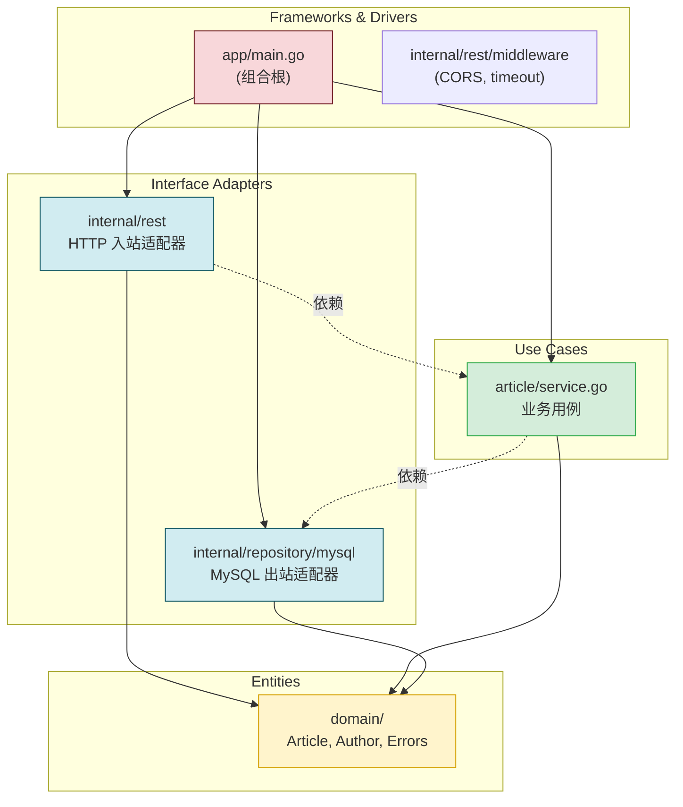
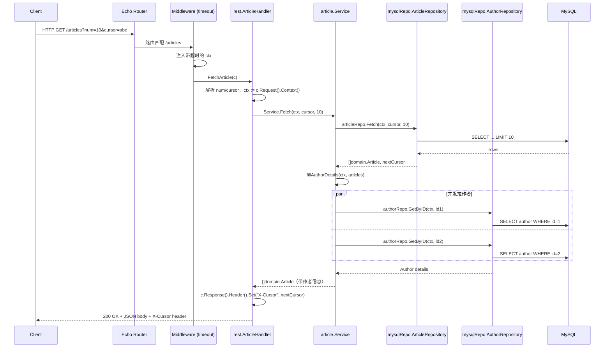

# go-clean-arch_demo

## 一句话定位

一个用 **Go + Echo + MySQL** 实现 Clean Architecture 的演示项目：一个极简的 Article/Author CRUD REST API，用来展示如何把"业务规则"与"框架/数据库/UI"解耦。

## 技术栈

| 角色 | 选型 |
|---|---|
| 语言 | Go 1.20 |
| HTTP 框架 | `labstack/echo/v4` |
| 数据库 | MySQL（驱动 `go-sql-driver/mysql`） |
| 日志 | `sirupsen/logrus` |
| 校验 | `go-playground/validator` |
| Mock | `mockery` + `DATA-DOG/go-sqlmock` |
| 配置加载 | `joho/godotenv` |

## 架构分层（从内到外）



依赖规则：**外圈依赖内圈，内圈不知道外圈存在**。`domain` 包不 import 任何东西；`article` 只依赖 `domain` + 自己定义的接口；`internal/rest`、`internal/repository/mysql` 都依赖 `domain` + 实现各自的接口；`app/main.go` 是唯一的"组合根"，知道全部具体类型。

## 目录结构与职责

```
go-clean-arch_demo/
│
├── app/main.go                     # 入口；唯一的组合根
│
├── domain/                          # 第 1 层：实体（最内层，零依赖）
│   ├── article.go                   #    Article 结构体
│   ├── author.go                    #    Author 结构体
│   └── errors.go                    #    ErrNotFound / ErrConflict / ErrInternalServerError
│
├── article/                         # 第 2 层：Use Case（业务用例）
│   ├── service.go                   #    Service 结构 + ArticleRepository/AuthorRepository 接口
│   ├── service_test.go              #    用 mock 测业务逻辑
│   └── mocks/                       #    mockery 自动生成
│
├── internal/
│   ├── rest/                        # 第 3 层：入站适配器（HTTP）
│   │   ├── article.go               #    Handler + ArticleService 接口 + 路由注册
│   │   ├── article_test.go          #    HTTP handler 测试
│   │   ├── middleware/
│   │   │   ├── cors.go              #    跨域中间件
│   │   │   └── timeout.go           #    请求超时（注入 ctx）
│   │   └── mocks/                   #    mockery 自动生成
│   │
│   └── repository/                  # 第 3 层：出站适配器（持久化）
│       ├── helper.go                #    共享查询工具
│       └── mysql/
│           ├── article.go           #    ArticleRepository 的 MySQL 实现
│           ├── article_test.go      #    用 sqlmock 测 SQL
│           └── author.go            #    AuthorRepository 的 MySQL 实现
│
├── go.mod / go.sum                  # 依赖
├── Makefile                         # make lint / make tests / make run
├── Dockerfile + compose.yaml        # 容器化
└── example.env                      # 配置示例
```

## 一个 HTTP 请求的完整旅程

以 `GET /articles?num=10&cursor=abc` 为例：



横切关注点：**ctx 贯穿全程**——`c.Request().Context()` → service → repo → MySQL，超时/取消可一路传到数据库。

## 这个项目展示的核心设计模式

| 模式 | 在哪里体现 | 一句话 |
|---|---|---|
| **依赖倒置（DIP）** | 接口在使用方包定义 | `article.ArticleRepository` 写在 `article/service.go`，不在 mysql 包 |
| **接口隔离（ISP）** | `rest.ArticleService` 只声明 6 个方法 | HTTP 层只看到自己需要的；service 私有方法不暴露 |
| **Go 惯用法：Accept Interfaces, Return Structs** | `NewService(...) *Service`、`NewArticleHandler(... svc) *ArticleHandler` | 入参接口、出参具体类型 |
| **构造器注入（DI）** | `article.NewService(repos)`、`rest.NewArticleHandler(echo, svc)` | 不靠全局变量、不靠服务定位器 |
| **错误翻译** | `getStatusCode(err)` 把 `domain.ErrXxx` → HTTP status | 业务错误和传输错误解耦 |
| **上下文传播** | `c.Request().Context()` 一路传到 repo | 超时/链路追踪可贯穿 |
| **Mock 解耦** | `//go:generate mockery` + `mocks/` 目录 | 测试时换实现，无需起数据库 |
| **组合根模式** | 只有 `app/main.go` 知道具体类型 | 装配只发生一次；其他文件对实现一无所知 |

## 项目的"教学价值"

读这个项目能学到 5 件事：

1. **如何在 Go 里做依赖反转**：靠 Go 的结构化类型系统（接口隐式满足），不用 Spring/DI 容器
2. **接口该放在哪**：永远放在使用方包里，不要图省事放在实现方或公共包
3. **如何分层测试**：service 用 mockery mock repo 测；handler 用 mock service 测；mysql repo 用 sqlmock 测真实 SQL
4. **错误如何在边界处翻译**：service 返回 `domain.ErrNotFound`，handler 翻译成 `404`
5. **Cursor 分页协议**：`X-Cursor` HTTP header 传递下一页游标，避免 `?page=N` 的深翻页性能问题

## 已知不足

| # | 问题 | 所在文件 |
|---|---|---|
| 1 | `ArticleHandler.Service` 字段导出，破坏封装 | `internal/rest/article.go` |
| 2 | `isRequestValid` 每次请求 `validator.New()`，浪费 | `internal/rest/article.go` |
| 3 | 错误响应格式不统一（字符串 vs JSON） | `internal/rest/article.go` |
| 4 | HTTP body 直接 bind 到 `domain.Article`，传输细节渗透进领域 | `internal/rest/article.go` Store |
| 5 | `getStatusCode` 的 `default` 吞未知错误，无编译期提醒 | `internal/rest/article.go` |
| 6 | `logrus.Error` 在 handler 和 service 重复记录 | `internal/rest/article.go` + `article/service.go` |
| 7 | `Update` / `GetByTitle` 在接口里却没路由 | `internal/rest/article.go` |
| 8 | `app/main.go` 是 god function（70+ 行混了 config、DB、装配、启动） | `app/main.go` |
| 9 | `main.go` 里硬编码 `loc=Asia/Jakarta` | `app/main.go` |
| 10 | 模块路径仍是 `github.com/bxcodec/go-clean-arch`，未迁到新仓库 | `go.mod` |

## 项目用一句话总结

> **这是一个用 ~600 行 Go 代码讲清楚 Clean Architecture 的最小可运行示例**——所有 Clean Architecture 的核心规则（依赖方向、接口反转、边界翻译）都得到体现，但故意保持小规模以便阅读。读它能学会"如何在 Go 里写可测试、可替换、不被框架绑架的业务代码"。

---

Forked from [bxcodec/go-clean-arch](https://github.com/bxcodec/go-clean-arch).
